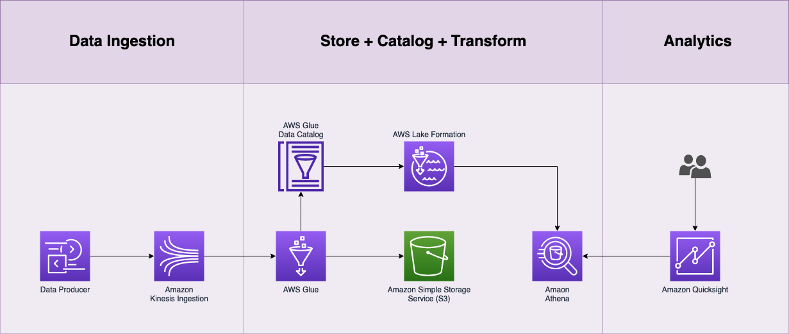

# FX Trade Results Demo


<!-- ABOUT THE PROJECT -->
## About The Project

This project demos a FX Trader app where trade execution data is placed on to a kinesis data stream, ingested using AWS Glue Structured Streaming and copied and S3 in parguet format and to a Glue Data Catalogue. This data is made avaiable in Amazon Athena via an external AWS Glue table. The project also uses Lake Formation and a consumer account and sets read-only and read-write permissions on the Glue Data Catalog resources created in the producer account. Therefore you do need 2 accounts to use this project (a producer account and a consumer account). This project does not require a VPC. It's completely serverless.

The project is deployed using Terraform with 2 exclusions:

1. Quicksight is not configured. Create a dataset manually using the external Athena table (trades table in AWS Glue). Change the field types to suit your query, for example, the volume, total_trades fields can be converted to int and the timestamp field can be converted to datetime to display timeseries graphs that show volume and trade count over time.

2. Create an IAM role for the consumer account that the Terraform deployment role can asssume. Then, update the variables ```variable consumer_iam_role ``` with the IAM role ARN that can be assumed via Terraform. Additionally, create the IAM roles for Lake Formation (Producer and Consumer ro and rw IAM roles).

In order to complete the configuration of the project, update the variables.tf file in the root of the project with your account resources.

 - glue_iam_role
 - consumer_iam_role
 - lf_cross_account_ro_shares
 - lf_cross_account_rw_shares

 The glue scripts, located in ```modules/glue/```, can be updated within this project and pushed to AWS Glue by running ```terraform apply```.


## High Level Architecture
---

### AWS Services Used
<!-- ABOUT THE PROJECT -->

  - Amazon Kinesis
  - AWS Glue
  - Amazon S3
  - Amazon Athena
  - AWS Lake Formation
  - AWS Quicksight (if using Analytics)




---

## Getting Started

Use terraform to run and install the components needed for this project once you have set up everything.

```
terraform init
terraform plan
terraform apply -auto-approve (for the brave)
terraform destroy
```

## Generating trade data

To create FX Trade Data, run ```python fx_trader.py``` in the root of the directory and ensure you have IAM permissions to invoke the fx-trade-results lambda. This project requires python 3.8.

```
python trader_executor.py

```

Note: run ```python fx_trader.py -h``` for additional parameter options.

Once the FX Trdae Data script is producing data, start the fx-trade-stream-job-glue to process the data within the Kinesis stream.

 ### Author

 Oli Leach - AWS Principal Solution Architect

 ---